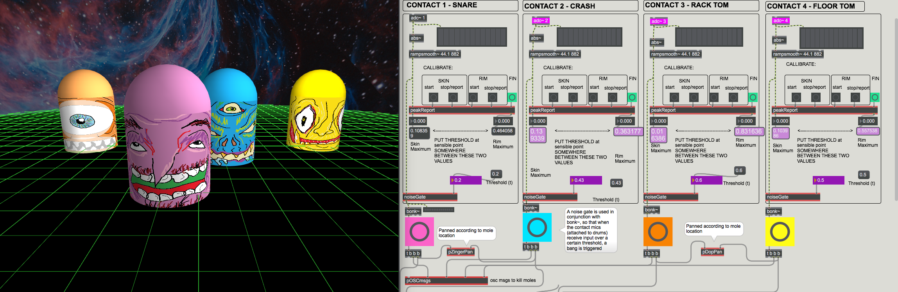

# Labour Movements

[Watch the video here](https://vimeo.com/332750759)

### **Labour movements is an interactive soundscape animation for performer, using live drums & electronics, and custom software built in Max/MSP & openFrameworks.** 

A drummer is presented with a cosmic whack-a-mole scenario, and uses specified drumming techniques to kill the space creatures which emerge at random locations on the 3-D plane. The software is audio-responsive, and multiple contact mics on the drumkit allow the performer to interact with the animation in real-time. 

Each rodent is accompanied by an ambient piece of audio, the volume and panning of which are determined by its location on the plane. As moles emerge and the piece progresses, different combinations of sounds create moving soundscapes, which accompany the drummer's performance. The drummer progresses the soundscape by killing a mole; another incarnation of the same sub-species will appear elsewhere, but the accompanying audio may be different. 

As such, the approach of the performer is not necessarily "shoot-on-sight" – rather, they may be incentivised to spare the animals from death if they are pleased with the musical composition that emerges. Once a mole has served its purpose and the drummer wants some variation, it's time to whack some moles. 

A mole met with death releases a final cry of pain/relief, as live audio from the drumkit is processed through complex variable delay lines in the Max patch, the parameters of which are determined by chance-based values. This enhances the overall composition with real-time sound effects.

The Max patch and openFrameworks app communicate via OSC messages. The Max patch relies on the **bonk~** object (Ted Apel & Barry Threw) for audio analysis of the drum signal. 

